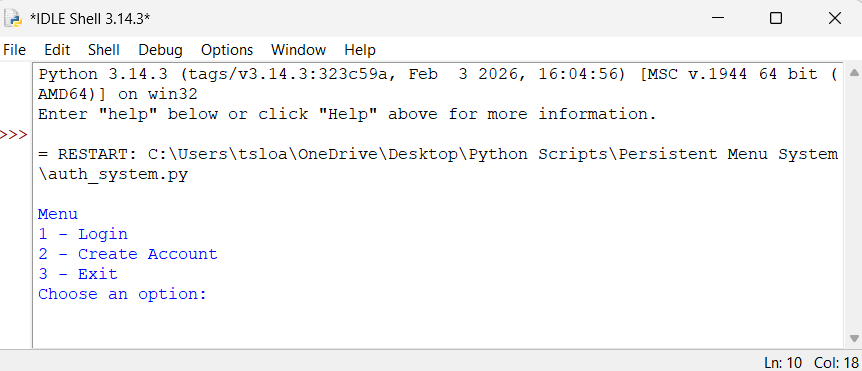

# Python Authentication System

This project is a command-line authentication system written in Python.

The goal of this project was to understand how authentication systems work internally.

## Features

- User account creation
- Password validation rules
- Password confirmation
- Password hashing with SHA-256
- Random salt generation
- Persistent user storage using JSON
- Login attempt lockout after 3 failed attempts
- Command-line menu interface

## Security Concepts Demonstrated

- Salted password hashing
- Brute-force protection (login lockout)
- Credential storage separation

## Program Flow

1. User selects an option from the menu
2. Account creation validates password rules
3. Password is hashed using SHA-256 with a random salt
4. User credentials are stored in a JSON file
5. Login attempts are limited to prevent brute-force attacks

## Program Interface

Example of the command-line interface when running the authentication system.

## Running the Program

Run the script:

python auth_system.py
